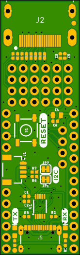
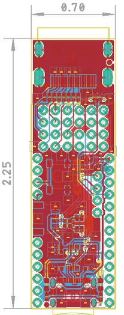

# Snō Shoe

A Qwiic, USB-C and HDMI breakout board for the [Alorium Technology Snō](https://www.sparkfun.com/products/15145)

The Alorium Technologies Snō is based on the Intel MAX 10 10M16SAU169C8G FPGA. It includes an ATmega328-compatible microcontroller core
which appears as an Arduino Uno and can be configured as normal through the Arduino IDE. It supports Serial, I2C and all the usual
Uno features.

The Snō Shoe makes it easy to connect to the Snō over:
- USB-C (instead of needing to use an FTDI adapter)
- HDMI
- Qwiic (I2C)

Paul has written an "Xcelerator Block" for the Snō which produces VGA text and graphics over HDMI. The assembled Snō Shoe is essentially an
Arduino-programmable Serial & Qwiic VGA Adapter.

- https://github.com/PaulZC/XLR8_VGA_HDMI_XB

## Repository Contents

- **/Hardware** - Eagle PCB, SCH and LBR design files
- **[LICENSE.md](./LICENSE.md)** contains the licence information
